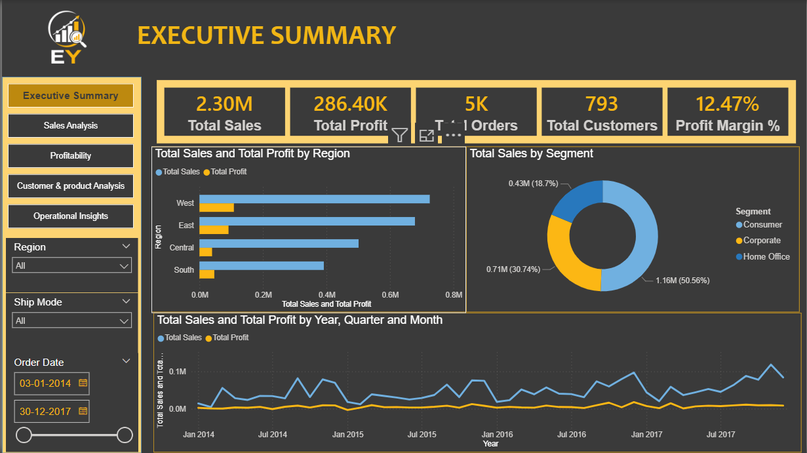

[README_retail-sales-profitability-dashboard.md](https://github.com/user-attachments/files/32474503/README_retail-sales-profitability-dashboard.md)
# Retail Sales & Profitability Dashboard

A 5-page Power BI report analyzing retail order data across sales, profitability, customer behavior, and operations — built on the widely-used "Sample Superstore" practice dataset.

## Note on the data

This project uses the **Superstore sample dataset**, a standard practice dataset commonly used in BI training. It's used here to demonstrate data modeling and DAX skills; the analysis and findings below were independently derived, not copied from a template.

## Data Model

Star schema: one fact table (`Data`) connected to five dimension tables:

- **Data** (fact) — order-level transactions: sales, profit, discount, order date
- **Customer**, **Product**, **Location**, **Segment**, **Ship Mode** (dimensions)

Includes a Date hierarchy for time-based analysis (Year → Quarter → Month).

## Pages

1. **Executive Summary** — top-line KPIs and trends
2. **Sales Analysis** — regional and time-based sales breakdown
3. **Profitability** — margin analysis by product and category
4. **Customer & Product Analysis** — top customers, product performance
5. **Operational Insights** — shipping and fulfillment metrics

45+ visuals total: line charts, bar charts, a donut chart, a map, a scatter chart, and a drill-down pivot table.

## DAX Measures

- Total Sales, Total Profit, Total Orders, Total Customers
- Profit Margin %
- Average Discount
- Average Order Value
- Average Shipping Days

## Key Finding

**Furniture items — bookcases, tables, and office chairs — accounted for the majority of the least profitable individual products**, with losses up to $938 per item despite high price points. This points to a category-level margin issue (likely driven by shipping cost or discount structure on bulky items) worth flagging for a pricing or fulfillment review.

## Dashboard

## Files in this Repo

- `Retail_Sales_Profitability.pbix` — Power BI file
- `/screenshots` — page-by-page dashboard images

## Skills Demonstrated

Power BI (Power Query, star-schema data modeling, DAX measures) · KPI dashboard design · profitability and margin analysis
